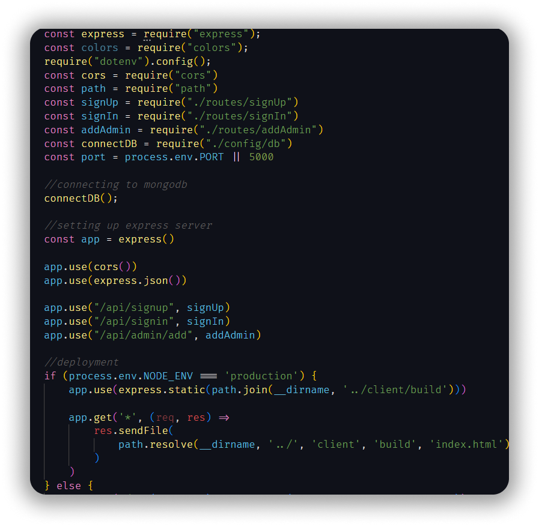
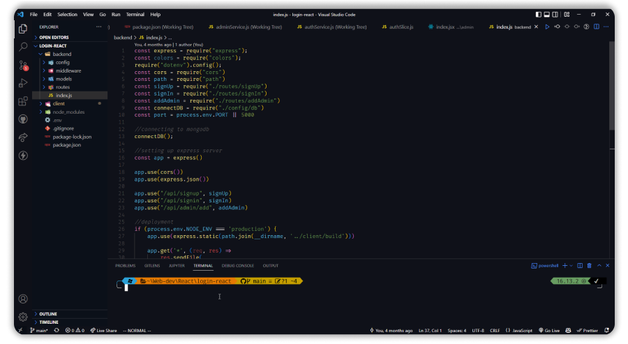

# [Theme Dark Modern](https://marketplace.visualstudio.com/items?itemName=HamzaChebbah.theme-dark-modern&ssr=false#overview)

## [GitHub Repo](https://github.com/Hamziss/Theme-Dark-Modern)

VSCode theme with a nice and modern syntax colors for better logic understanding

## SCREENSHOT
<br/>


### Node Server :
<br/>



### Full Screen :



### Tweaks & theming

If you want to play around with colors, use the setting
`workbench.colorCustomizations` to customize the currently selected theme. For
example, you can add this snippet in your "settings.json" file:

```json
"workbench.colorCustomizations": {
  "tab.activeBackground": "#282c34",
  "activityBar.background": "#282c34",
  "sideBar.background": "#282c34",
  "tab.activeBorder": "#d19a66",
}
```

or use the setting `editor.tokenColorCustomizations`

```json
"editor.tokenColorCustomizations": {
  "[Theme Dark Modern]": {
    "textMateRules": [
      {
        "scope": ["source.js"],
        "settings": {
          "foreground": "#e06c75"
        }
      }
    ]
  }
}
```

**Enjoy!**
